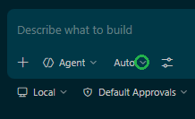
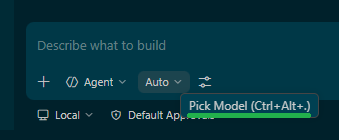
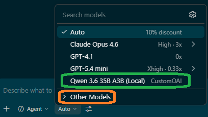
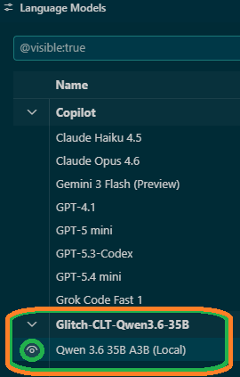

# Post-Installation Guide: Setting Up Your Local Model

> [!TIP]
> Press **Ctrl + Shift + V** to open this guide in Preview Mode for a better reading experience.

Congratulations! **glitch-CLT** is now installed. To start using your local model in VS Code Insiders, follow these simple configuration steps.

### 1. Open the Model Selection Menu
In the chat interface, look for the model selection dropdown (usually labeled "Auto"). Click the **dropdown arrow** highlighted in green.

### 2. Pick Your Model
Hover over or click the **"Pick Model"** option (Shortcut: `Ctrl+Alt+.`).

### 3. Select the Local Qwen Model
In the model list, look for **Qwen 3.6 35B A3B (Local)**. 

*   **Standard Selection:** Click the area highlighted in **green**.
*   **If the model is not visible:** Click the **"Other Models"** section highlighted in **orange** to expand it.

### 4. Ensure Visibility
Finally, verify that the **Glitch-CLT-Qwen3.6-35B** model is active and visible. The **eye icon** should be enabled as shown in the green circle below.

---
**Happy Coding!** Your local inference engine is now powering your development.
